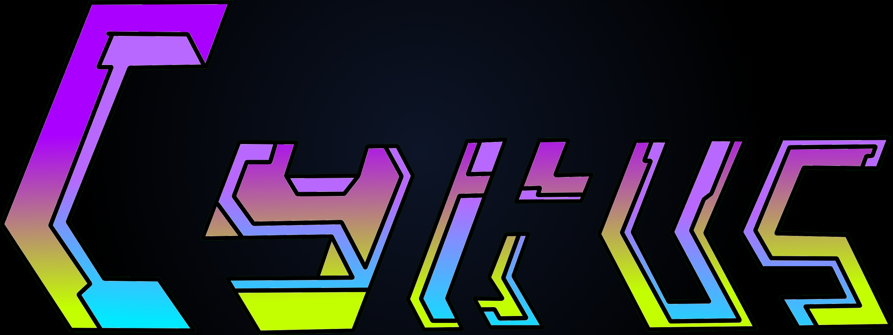

# Projektseite

## Über das Prjekt ...

## Progress Blog

### 13.08.2019 (Erste Stunde) 

Heute haben wir eine Einführung in das Fachgebiet der Informatik bekommen, dabei stehen uns viele Möglichkeiten für unsere Projektgestaltung offen. Zur Inspiration haben wir uns Projekte des letzten Jahres angeschaut. Dinge die ich mir selber vorstellen könnte wären: Game modding (z.B. das Spiel Europa Universalis IV ), aber auch Programmieren in Game Engines wie  Unity und Unreal Engine. Nach Rescherche habe ich herausgefunden, dass beide dieser Programme/Engines mit C# programmierbar sind. Unity solle dabei vorallem für Anfänger benutzerfreundlicher sein. 

### 14.08.2019 (Zweite Stunde) 
Momentan bin ich immer noch nicht in einer festen Gruppe, weil keiner meiner Meinung nach das machen will was mir im Kopf schwebt und eigentlich bin ich gerne ein selbstständiger Mensch. Während der Unterrichtsstunde, konnte die zur Anmeldung notwenige User Verifizierung, aufgrund einer veralteten Browser oder Flash Version nicht geladen werden. Am Nachmittag wurde dieser Account erstellt, die Grafik erstellt sowie dieser Blog. 

### 15.08.2019 (Dritte Stunde) 
...
